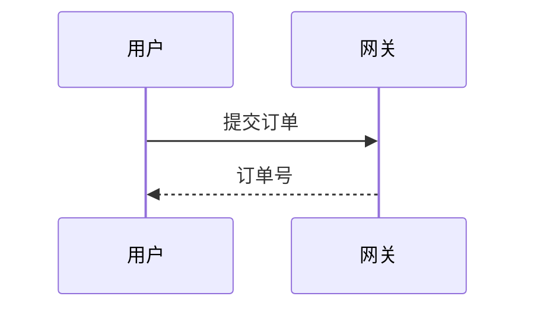

# 把设计写进 docmost

## 为什么要做这件事

AI 写完代码，用户手上只有一堆 diff。**为什么这样设计、模块之间怎么交互、状态怎么流转，
全在一次性的对话里，会话关掉就没了。** 过两个月或者项目一交接，没人说得清当初为什么这么写。

这个 skill 存在的全部理由就是堵上这个洞：让用户翻得到每一版设计，看得出这一版跟上一版
差在哪。所以文档要写**判断和取舍**，不是把代码翻译成中文——「`OrderService` 有一个
`create` 方法」这种话对用户零价值，「订单号在服务端生成而不是客户端，因为客户端重试会
产生重复单」才是他要的。

## 什么时候写

**跟代码同一轮产出，不要攒到最后补。** 一个功能做完就写这个功能的文档；
攒到收尾再补，写出来的必然是对着代码倒推的说明书，当初权衡掉的方案已经想不起来了。

要写的场合：新增功能、改动对外接口 / 数据结构 / 业务规则、重构模块结构。
纯 bug 修复、改错别字、调格式不用写。

## 写到哪

先 `list_spaces` 找到当前项目对应的知识空间（**一个项目一个空间**，名字通常就是仓库名）。
找不到对应空间时**问用户**该写进哪个，不要自己挑一个看着像的写进去——写错空间比没写更难发现。

再 `list_pages` 看这个空间已有的页面树。页面结构：

```
<知识空间> = 项目
  └─ <功能名>              父页，一句话说明这个功能是干什么的
       ├─ 需求说明
       ├─ 概要设计
       └─ 详细设计
```

已经有同名功能的父页就往里补 / 改，不要另起一棵——同一个功能两棵页面树，
用户下次看的时候不知道该信哪棵。

## 八样东西一样都不能少

| 要交付的 | 落在哪一页 |
| --- | --- |
| 需求说明 | 需求说明 |
| 概要设计 | 概要设计 |
| 详细设计 | 详细设计 |
| 流程图 | 概要设计（业务主流程） |
| 泳道图 | 概要设计（跨角色 / 跨系统的协作） |
| 时序图 | 详细设计（一次调用链上各组件怎么来回） |
| 类图 | 详细设计（数据结构与依赖关系） |
| 状态图 | 详细设计（有状态字段的实体，如订单、任务、审批） |

图放进对应的设计页里，不单独开页：图是用来解释设计的，跟正文分开放，两边都会慢慢对不上。

**没有的就明说没有。** 这个功能不涉及跨角色协作，就在概要设计里写「无跨角色流程，
不画泳道图」，不要硬凑一张只有一条泳道的图。空图比没图更误导。

### 每一页写什么

**需求说明**：要解决谁的什么问题、做完之后行为上有什么变化、明确不做什么（边界）、
验收标准。不写技术方案。

**概要设计**：整体怎么拆、每块负责什么、块与块之间怎么调用、**为什么选这个方案、
放弃了哪些方案以及为什么**。加流程图与泳道图。

**详细设计**：接口签名与出入参、数据结构 / 表结构、关键算法与边界条件、
错误与异常怎么处理、并发与幂等怎么保证。加时序图、类图、状态图。

## 图怎么写

一律写成 Markdown 里的 Mermaid 代码块，不要渲染成图片再传附件——图是文本才能检索、
才能 diff，变成 PNG 之后用户就只能看，比不出两版差在哪。

````markdown

````

各类图对应的 Mermaid 语法：流程图 `flowchart`、时序图 `sequenceDiagram`、
类图 `classDiagram`、状态图 `stateDiagram-v2`、泳道图用 `flowchart` 加 `subgraph`
表示泳道。图里的中文不要加引号以外的特殊字符，避免解析失败。

## 怎么调工具

新建：`create_page`，父页 id 用 `parent_id` 传。先建父页拿到 id，再建三个子页。

修改：**必须先 `get_page` 拿到当前 `version`，再把这个 version 传给 `update_page`。**
这是乐观锁——用户可能正在网页上改同一篇，版本对不上会报错，这时要重新 `get_page`
看清楚用户改了什么，把自己的改动**合并**上去再提交，不要直接用自己的版本盖过去。

改的时候是**整篇替换** `content_md`，所以要先把原文读回来，在原文基础上改，
不能只把新增的那段传上去。

**没有删除工具**，这是故意的。要删页面让用户在网页上删。

## 接不上的时候

MCP 工具调不通（没配令牌、地址不对、docmost 没起来）时：

1. 把文档写进项目仓库的 `docs/` 目录，文件名对应页面名。**不要因为写不进 docmost 就不写了**——
   文档的价值不取决于它存在哪。
2. 明确告诉用户「文档写在本地 `docs/` 了，docmost 没连上，原因是 X」，并说明怎么修
   （设 `BGSSAI_DOCMOST_URL` 和 `BGSSAI_DOCMOST_TOKEN` 两个环境变量，令牌在 docmost
   网页里签发）。

静默跳过是最坏的做法：用户以为文档写好了，等到要看的时候才发现什么都没有。

## 写完告诉用户

给出写了哪几篇、在哪个知识空间、是新建还是改的第几版。用户要的是「能翻到」，
不是一堆页面 id。
